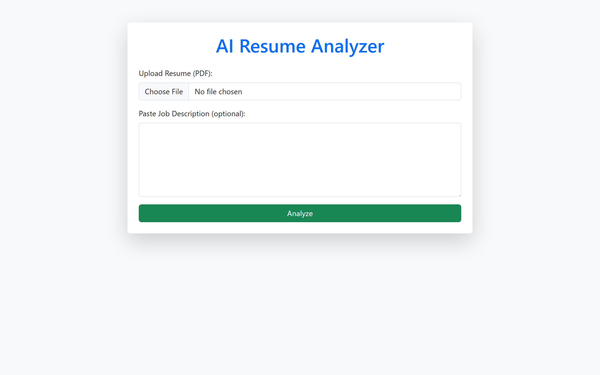
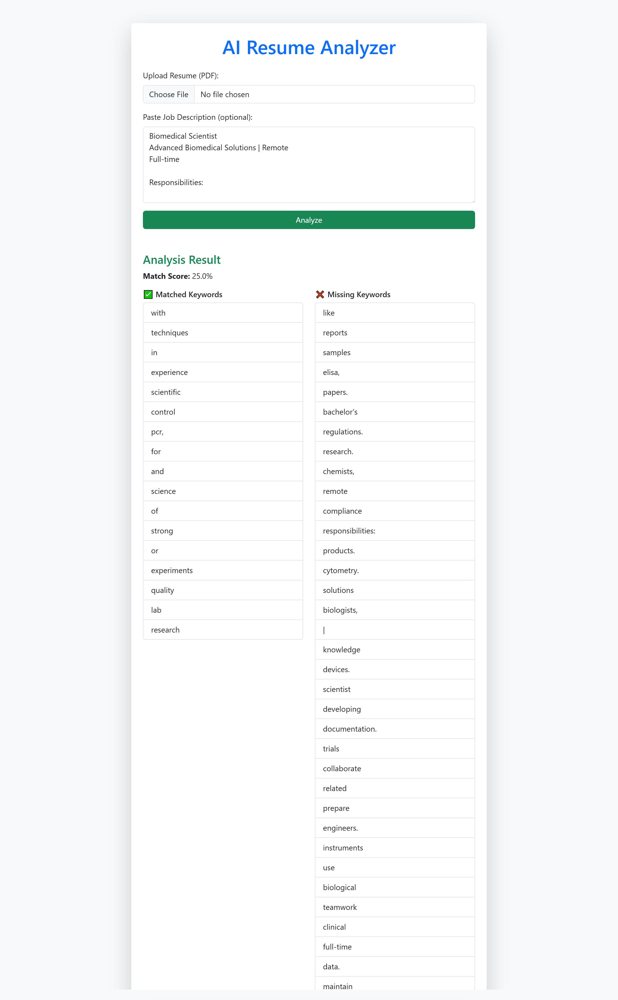

# 🧠 AI-Powered Resume Analyzer (Django)

This is a simple Django web application that allows users to upload their resumes and compare them against a job description. It highlights **matched** and **missing** keywords and calculates a **match score**, helping candidates optimize their resumes for job roles.

---

## 🔍 Features

- 📄 Upload PDF resumes
- 🧾 Paste or type job descriptions
- 🔍 Extracts text using `pdfminer.six`
- 📊 Calculates keyword match percentage
- ✅ Shows matched and missing keywords
- 💻 Fully responsive Bootstrap interface

---

## 🛠️ Tech Stack

- Python 3
- Django
- pdfminer.six
- Bootstrap 5
- Gunicorn (for deployment)

---

## 🚀 Live Demo

> 🔗 [https://your-deployed-url.onrender.com](https://your-deployed-url.onrender.com)

---

## 📷 Screenshots


<br />


---

## 📦 Installation

```bash
git clone https://github.com/1s44c-0/Resume-Analyzer.git
cd resume-analyzer
python -m venv venv
source venv/bin/activate  # or venv\Scripts\activate on Windows
pip install -r requirements.txt
python manage.py runserver
